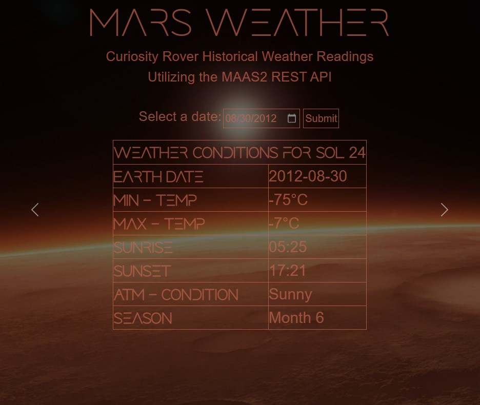
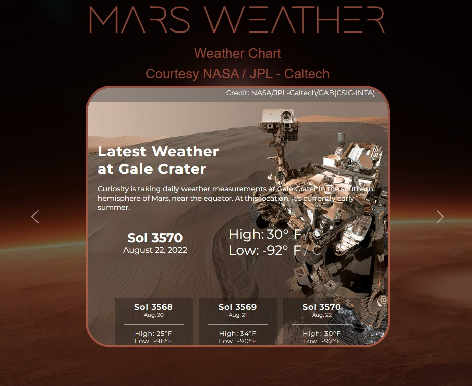
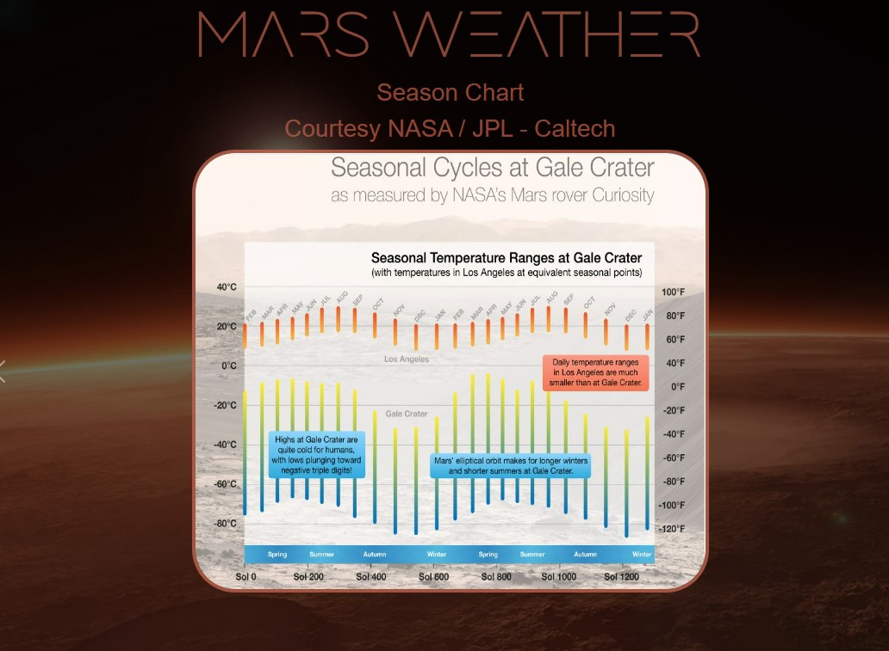

**<h1 align="center"> MARS WEATHER APP</h1>**

### This app displays historical Martian weather from data collected by the Curiosity rover. The user enters/selects a date and clicks submit. The AJAX API request returns data in JSON format which is then parsed to populate the table.

### There are some additional slides showing an animated image of the rover, and the Rover Environmental Monitoring Station (REMS), that take the weather readings and some additonal weather slides from the NASA/JPL websites. These are all on a carousel created using Bootstrap.

### The app is responsive and can be viewed on a cell phone.

---

### **Background:**

The **<u>[Curiosity Rover](https://mars.nasa.gov/msl/home/)</u>** landed on Mars in August of 2012. It has been gathering data since then. This app utilizes the **<u>[MAAS2 API](https://www.programmableweb.com/api/maas2-rest-api-v100)</u>** which returns JSON data, of weather measurements, based on an entered Martian sol date (with 08/06/2012 being sol 1 for this mission).

---

### **Getting Started**

JavaScript must be enabled in the browser for this page to work.

Enter/select a date and click submit. If there is available data, for that day, it will be displayed in the table.

- GitHub Link **[Mars Weather](https://github.com/npsaunders/Mars-Weather-App)**
- GitHub Pages Live Link **[Mars Weather](https://npsaunders.github.io/Mars-Weather-App/)**

---

### **Technologies Used**

- HTML5
- CSS3
- JavaScript
- jQuery
- Bootstrap
- AJAX

---

### **Screenshots**

Main Table

Animation of REMS on Curiosity

iframe of current weather conditions

Seasonal weather

---

### **Future Enhancements**

- Looking to see if it's possible to create an interactive map, of the rover waypoints/sols, and let the user click the waypoint to get the weather at that location. Due to Same Origin Policy, I cannot directly interact with the iframe, of the NASA map, to get the sol based on location.

[Same Origin Policy](https://developer.mozilla.org/en-US/docs/Web/Security/Same-origin_policy)

<a href="https://mars.nasa.gov/maps/location/?mission=MSL&site=NOW&mapLon=137.39720821380618&mapLat=-4.752126563545443&mapZoom=16&globeLon=137.3978687&globeLat=-4.663687049999997&globeZoom=13&globeCamera=0,-2441.40625,0,0,1,0&panePercents=0,100,0&on=Current Position$1.00,Waypoints$1.00,Surface View$1.00,Rover Path$1.00,Labels$1.00,Basemap$1.00,Gale Crater Map$1.00" target="_blank">Mars Interactive Map</a>

- Look at carousel slide image heights to reduce "jumping" when clicking the carousel buttons.

---

### **Other Interesting Links**

[Curiosity Rover](https://mars.nasa.gov/msl/home/)

[Curiosity Rover Simulator](https://eyes.nasa.gov/curiosity/)

[Location of Mars satellites and rovers - interactive](https://eyes.nasa.gov/apps/mrn/index.html#/mars)

[NASA-AMMOS/MMGIS (Multi-Mission Geographical Information System)](https://github.com/NASA-AMMOS/MMGIS)

[NASA Mars Rover Games](https://mars.nasa.gov/gamee-rover/)

---

### **References/License Info**

- **<a href="https://www.programmableweb.com/api/maas2-rest-api-v100" target="_blank">MAAS2 Mars Weather Data API</u>**

- **<a href="https://www.nasa.gov/multimedia/guidelines/index.html" target="_blank">NASA Image Policy</u>**

- **<a href="https://www.jpl.nasa.gov/jpl-image-use-policy" target="_blank">JPL/Cal-Tech Image Policy</u>**

- **<a href="https://getbootstrap.com/docs/4.0/about/license/#:~:text=Bootstrap%20is%20released%20under%20the%20MIT%20license%20and%20is%20copyright%202018%20Twitter" target="_blank">Bootstrap License Policy</u>**

- **<u>[Averox font license](./font/!license.txt)</u>**

  

  

  

